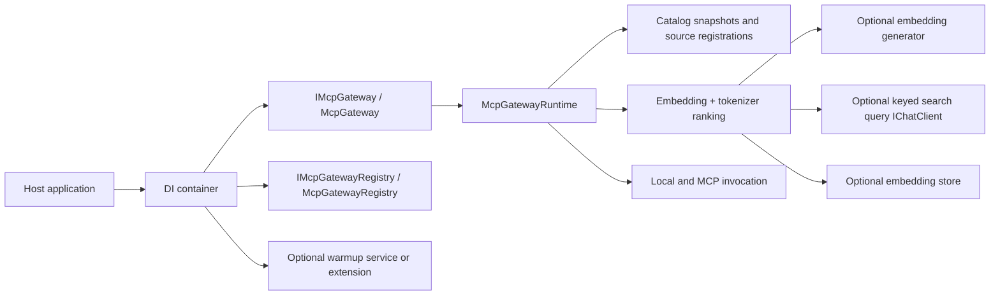

# ADR-0001: Gateway Runtime Boundaries And Search Fallback

## Context

`ManagedCode.MCPGateway` now ships a larger set of architectural decisions than the original minimal package shape:

- one public gateway facade for search and invocation
- one separate registry surface for catalog mutation
- lazy index building with optional eager warmup hooks
- search strategy defaults that combine embeddings, tokenizer ranking, and tokenizer fallback
- optional English query normalization through a keyed `IChatClient`

Those decisions affect package boundaries, DI wiring, startup behavior, search ranking, and consumer documentation. They need one durable record so the package does not drift back toward a god-object gateway or undocumented search behavior.

## Decision

`ManagedCode.MCPGateway` will keep one thin public search/invoke facade, one separate DI-managed registry, lazy index building with optional eager warmup, and `SearchStrategy.Auto` as the default search mode that uses embeddings when available and tokenizer ranking otherwise.

## Diagram

## Alternatives

### Put registry mutation back into `McpGateway`

Pros:

- fewer types for consumers to discover

Cons:

- mixes runtime execution with mutable catalog lifecycle
- pushes `McpGateway` back toward a god object
- makes DI roles less explicit

### Require every host to call `BuildIndexAsync()` manually

Pros:

- simpler runtime story on paper

Cons:

- forces boilerplate on every consumer
- makes package usage worse for lazy, CLI, and test hosts
- does not fit the package-first library design

### Make tokenizer ranking the only supported search path

Pros:

- fully deterministic local behavior
- no optional embedding dependency path

Cons:

- discards higher-quality vector search when hosts already provide embeddings
- weakens the package for richer hosts without any real simplification of the public API

### Make embeddings mandatory

Pros:

- one ranking path

Cons:

- breaks zero-dependency and local-only deployments
- contradicts the package requirement that lexical search must stay functional without embeddings

## Consequences

Positive:

- consumers get one stable execution surface through `IMcpGateway`
- dynamic catalog mutation stays explicit through `IMcpGatewayRegistry`
- hosts can choose lazy startup, explicit warmup, or hosted background warmup
- the default search behavior remains production-safe without forcing embeddings
- optional AI-assisted English normalization improves multilingual and noisy search without hardcoding phrase lists

Trade-offs:

- the package keeps more moving parts than a tokenizer-only library
- runtime docs must stay synchronized with real DI and search behavior
- tests must cover both vector and tokenizer paths, including fallback behavior

Mitigations:

- keep `McpGateway` thin and delegate orchestration to `McpGatewayRuntime`
- keep registry state in a separate service
- keep `README.md`, `docs/Architecture/Overview.md`, and the search feature spec aligned with this ADR

## Invariants

- `McpGateway` MUST stay a search/invoke facade and MUST NOT own registry mutation behavior.
- `IMcpGatewayRegistry` MUST stay DI-managed and MUST remain the mutation surface for local tools and MCP sources.
- Index building MUST be lazy by default and MAY be triggered eagerly through documented opt-in warmup paths.
- `McpGatewaySearchStrategy.Auto` MUST stay the default search strategy.
- Tokenizer-backed ranking MUST remain functional when no embedding generator is registered.
- Query normalization MUST stay optional and MUST only use a keyed `IChatClient`.
- Consumer-facing docs MUST describe the shipped runtime and configuration behavior with real examples.

## Rollout And Rollback

Rollout:

1. Keep the current runtime, registry, warmup, and search strategy behavior as the supported package design.
2. Link this ADR from `docs/Architecture/Overview.md`.
3. Keep `README.md` examples aligned with the public API and DI story.

Rollback:

1. Revert the runtime boundary and search-default changes together, not piecemeal.
2. Remove or supersede this ADR with a new record if the public architecture changes materially.
3. Update `README.md` and `docs/Architecture/Overview.md` in the same change as any rollback.

## Verification

- `dotnet restore ManagedCode.MCPGateway.slnx`
- `dotnet build ManagedCode.MCPGateway.slnx -c Release --no-restore`
- `dotnet test --solution ManagedCode.MCPGateway.slnx -c Release --no-build`
- `dotnet build ManagedCode.MCPGateway.slnx -c Release --no-restore -p:RunAnalyzers=true`
- `roslynator analyze src/ManagedCode.MCPGateway/ManagedCode.MCPGateway.csproj -p Configuration=Release --severity-level warning`
- `roslynator analyze tests/ManagedCode.MCPGateway.Tests/ManagedCode.MCPGateway.Tests.csproj -p Configuration=Release --severity-level warning`
- `cloc --include-lang=C# src tests`

## Implementation Plan (step-by-step)

1. Keep the public runtime surface centered on `IMcpGateway`, `IMcpGatewayRegistry`, and `McpGatewayToolSet`.
2. Keep runtime orchestration under `Internal/Runtime/` and source mutation under `Internal/Catalog/`.
3. Keep optional initialization paths documented through the service-provider extension and hosted warmup service.
4. Keep search ranking documented as embeddings-first when available, tokenizer-backed otherwise, with optional English normalization.
5. Keep tests and docs updated together whenever those runtime boundaries or defaults change.
