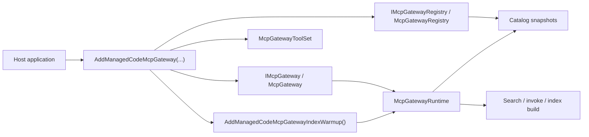

# ADR-0001: Runtime Boundaries And Index Lifecycle

## Context

`ManagedCode.MCPGateway` started as a single gateway concept, but the package now has three distinct concerns:

- runtime search and invocation for local `AITool` instances and remote MCP tools
- mutable catalog registration for local tools, stdio/HTTP MCP servers, and deferred `McpClient` factories
- index lifecycle management for lazy builds, hosted warmup, and rebuilds after registry mutations

Recent changes also made index construction cancellation-aware and single-flight, so startup warmup, shutdown, and concurrent callers do not keep issuing duplicate MCP loads or continue rebuilding after a canceled operation should stop.

The repository needs an explicit record for these boundaries so the public package surface, internal runtime structure, and README examples stay aligned.

## Decision

`ManagedCode.MCPGateway` will keep a thin public runtime facade, a separate DI-managed registry mutation surface, and an internal runtime orchestrator with lazy, cancellation-aware single-flight index builds plus optional eager warmup integration.

## Diagram

## Alternatives

### Alternative 1: Keep one monolithic gateway type that also mutates the registry

Pros:

- fewer types to explain
- direct mutation calls on the same service

Cons:

- violates single responsibility for runtime versus mutation
- makes DI usage less explicit
- encourages `McpGateway` to become a god object again

### Alternative 2: Require every host to call `BuildIndexAsync()` manually

Pros:

- very explicit startup workflow
- easy to reason about in small demos

Cons:

- forces boilerplate on every consumer
- easy to forget in real hosts
- contradicts the package goal of working lazily by default

### Alternative 3: Use blocking locks around registry mutation and index lifecycle

Pros:

- straightforward first implementation
- familiar concurrency model

Cons:

- obscures cancellation and shutdown behavior
- harder to scale under concurrent search/build callers
- already caused readability and lifecycle issues in this repository

## Consequences

Positive:

- public DI wiring is explicit: `IMcpGateway` for runtime work, `IMcpGatewayRegistry` for catalog mutation, `McpGatewayToolSet` for meta-tools
- hosts get lazy behavior by default and optional eager warmup through `InitializeManagedCodeMcpGatewayAsync()` or `AddManagedCodeMcpGatewayIndexWarmup()`
- cancellation now propagates into source loading, embedding generation, and embedding-store I/O during index builds
- runtime rebuilds after registry mutations remain automatic without forcing every host into startup code

Trade-offs:

- there are more internal collaborator types to document
- lazy behavior means startup failures may surface on first use unless the host opts into eager warmup
- single-flight lifecycle code is more subtle than a naive sequential implementation

Mitigations:

- keep `McpGateway` thin and document the boundaries in `docs/Architecture/Overview.md`
- keep README examples for both lazy default usage and eager warmup
- cover cancellation, retry-after-cancel, and concurrent build behavior with tests

## Invariants

- `IMcpGateway` MUST remain the public runtime facade for build, list, search, invoke, and meta-tool creation.
- `IMcpGatewayRegistry` MUST remain the public mutation surface for adding tools and MCP sources after container build.
- `AddManagedCodeMcpGateway(...)` MUST register `IMcpGateway`, `IMcpGatewayRegistry`, and `McpGatewayToolSet`.
- Index builds MUST be lazy by default and MUST rebuild automatically after registry mutations invalidate the snapshot.
- Hosted warmup MUST stay optional and MUST use the same runtime/index path as normal gateway operations.
- Cancellation of `BuildIndexAsync(...)` MUST propagate into underlying source loading and embedding work.

## Rollout And Rollback

Rollout:

1. Keep the separated facade/registry/runtime structure in `src/ManagedCode.MCPGateway/`.
2. Keep README startup guidance aligned with lazy default plus optional eager warmup.
3. Keep tests covering concurrent builds, cancellation, and post-mutation rebuild behavior.

Rollback:

1. Revert the runtime/registry split only if the package intentionally changes back to a single mutable gateway facade.
2. Remove warmup helpers only if startup prewarming is intentionally dropped as a supported scenario.

## Verification

- `dotnet restore ManagedCode.MCPGateway.slnx`
- `dotnet build ManagedCode.MCPGateway.slnx -c Release --no-restore`
- `dotnet build ManagedCode.MCPGateway.slnx -c Release --no-restore -p:RunAnalyzers=true`
- `dotnet test --solution ManagedCode.MCPGateway.slnx -c Release --no-build`
- `roslynator analyze src/ManagedCode.MCPGateway/ManagedCode.MCPGateway.csproj -p Configuration=Release --severity-level warning`
- `roslynator analyze tests/ManagedCode.MCPGateway.Tests/ManagedCode.MCPGateway.Tests.csproj -p Configuration=Release --severity-level warning`
- `cloc --include-lang=C# src tests`

## Implementation Plan (step-by-step)

1. Keep `McpGateway` as a thin public facade over `McpGatewayRuntime`.
2. Keep `McpGatewayRegistry` as the DI-managed mutation surface and snapshot source.
3. Keep `McpGatewayRuntime` responsible for lazy single-flight index builds and search/invocation orchestration.
4. Expose eager warmup through service-provider and hosted-service extensions instead of forcing manual `BuildIndexAsync()` in every host.
5. Keep cancellation and concurrency regression coverage in the search/build test suite.

## Stakeholder Notes

- Product: hosts can choose lazy startup or eager warmup without changing the public runtime API.
- Dev: runtime and mutation responsibilities are intentionally separate and must stay that way.
- QA: warmup, cancellation, and rebuild-after-mutation scenarios are first-class verification targets.
- DevOps: startup behavior is configurable; eager warmup is the fail-fast option for production hosts.
