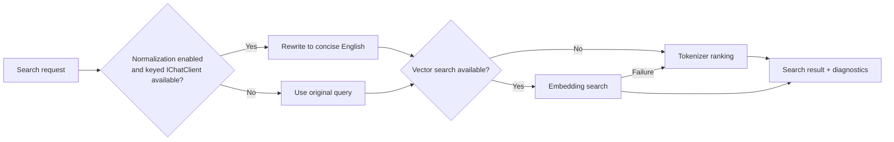

# ADR-0002: Search Ranking And Query Normalization

## Context

`ManagedCode.MCPGateway` must stay useful when a host does not register embeddings, while still taking advantage of embeddings when they are available. The package also needs to handle multilingual, typo-heavy, and weakly specified queries without degenerating into hardcoded phrase lists.

Recent work introduced a tokenizer-backed ranking pipeline with BM25-style field scoring, token and character n-gram similarity, approximate typo handling, optional English query normalization, and automatic fallback from vector search to tokenizer ranking. The package also removed public tokenizer selection and standardized on the built-in `ChatGptO200kBase` path.

This decision needs a durable record because it affects defaults, DI integration, tests, and user-facing README guidance.

## Decision

`ManagedCode.MCPGateway` will use `SearchStrategy.Auto` as the default production mode, keep one built-in `ChatGptO200kBase` tokenizer-backed search path, and improve non-vector retrieval through mathematical ranking plus optional English query normalization via a keyed `IChatClient`.

## Diagram

## Alternatives

### Alternative 1: Embeddings only

Pros:

- simple ranking story
- potentially higher semantic quality when embeddings are always available

Cons:

- unusable in zero-embedding hosts
- adds a hard external dependency for a core package feature

### Alternative 2: Keep multiple tokenizer options public

Pros:

- more tuning knobs for experiments
- easier A/B comparisons in package consumers

Cons:

- larger public API surface
- more documentation and compatibility burden
- unnecessary once the built-in tokenizer path became the only supported production option

### Alternative 3: Improve search with hardcoded synonym or phrase lists

Pros:

- quick tactical gains for a few known queries
- easy to demo

Cons:

- brittle and domain-specific
- violates the repository rule to prefer mathematical ranking improvements over query text hacks
- scales poorly across languages and noisy inputs

## Consequences

Positive:

- `SearchStrategy.Auto` works as one production default across embedding and zero-embedding hosts
- tokenizer search remains deterministic and local when no embedder is registered
- optional English normalization improves multilingual/noisy inputs without making the package depend on an AI client
- search quality improvements are explainable through diagnostics and testable through evaluation buckets

Trade-offs:

- ranking logic is more sophisticated than a flat score function
- multilingual quality without a normalizer still depends on tokenizer overlap and character n-grams
- documentation must explain that normalization is optional and keyed, not bundled by the package

Mitigations:

- keep the tokenizer path fully self-contained and deterministic
- keep README examples for both normalized and non-normalized deployments
- keep regression/evaluation tests for high-relevance, borderline, typo, multilingual, weak-intent, and irrelevant buckets

## Invariants

- `SearchStrategy.Auto` MUST remain the default search strategy.
- `SearchQueryNormalization` MUST default to `TranslateToEnglishWhenAvailable`.
- The package MUST keep only one built-in tokenizer-backed search path and MUST NOT expose stale tokenizer-choice options.
- If no embedding generator is registered, search MUST still function through tokenizer-backed ranking.
- If vector search fails for a request, the gateway MUST fall back to tokenizer-backed ranking and emit diagnostics instead of failing the request.
- If English normalization is enabled but no keyed `IChatClient` is registered, search MUST continue with the original query.
- Search-quality improvements MUST prefer mathematical scoring changes over hardcoded phrase exceptions.

## Rollout And Rollback

Rollout:

1. Keep README defaults aligned with `SearchStrategy.Auto`, `SearchQueryNormalization`, and the top-5 default result size.
2. Keep `McpGatewayServiceKeys.SearchQueryChatClient` documented as the optional keyed normalizer dependency.
3. Keep tokenizer evaluation tests current with real noisy-query buckets.

Rollback:

1. Reintroduce a public tokenizer-selection option only if there is a concrete product requirement and a supported compatibility story.
2. Disable normalization by default only if the package intentionally stops preferring English retrieval convergence for multilingual or noisy inputs.

## Verification

- `dotnet restore ManagedCode.MCPGateway.slnx`
- `dotnet build ManagedCode.MCPGateway.slnx -c Release --no-restore`
- `dotnet build ManagedCode.MCPGateway.slnx -c Release --no-restore -p:RunAnalyzers=true`
- `dotnet test --solution ManagedCode.MCPGateway.slnx -c Release --no-build`
- `roslynator analyze src/ManagedCode.MCPGateway/ManagedCode.MCPGateway.csproj -p Configuration=Release --severity-level warning`
- `roslynator analyze tests/ManagedCode.MCPGateway.Tests/ManagedCode.MCPGateway.Tests.csproj -p Configuration=Release --severity-level warning`
- `cloc --include-lang=C# src tests`

## Implementation Plan (step-by-step)

1. Keep `McpGatewayOptions` defaults aligned with the intended production behavior.
2. Keep the tokenizer-backed ranking pipeline in `Internal/Runtime/Search/` field-aware and diagnostic-friendly.
3. Keep the optional keyed English query normalizer behind `McpGatewayServiceKeys.SearchQueryChatClient`.
4. Keep README examples for tokenizer-only, auto, embeddings, and optional normalization scenarios.
5. Keep evaluation coverage current and representative of noisy production-like queries.

## Stakeholder Notes

- Product: the package has one recommended search default that works with or without embeddings.
- Dev: search quality work should continue through ranking math and evaluation data, not manual phrase hacks.
- QA: typo, multilingual, weak-intent, and irrelevant buckets are required test coverage, not optional benchmark extras.
- DevOps: hosts may run fully local tokenizer search or add keyed chat/embedding services when needed.
