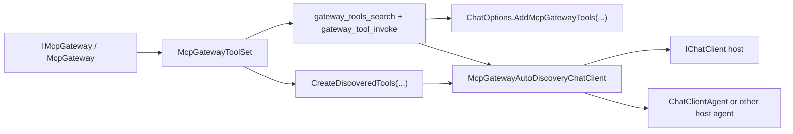

# ADR-0003: Reusable Chat-Client And Agent Tool Modules

## Context

`ManagedCode.MCPGateway` already exposes the gateway as two reusable meta-tools through `McpGatewayToolSet` and `IMcpGateway.CreateMetaTools(...)`.

The package now also needs to prove that these tools integrate cleanly with two host-side consumption patterns:

- direct `IChatClient` tool-calling
- Microsoft Agent Framework agents that accept an `IChatClient`

The user explicitly asked for:

- very lightweight host integration
- deterministic scenario-driven tests
- coverage both without embeddings and with embeddings
- a staged auto-discovery flow where the model starts with only two gateway tools, then receives only the currently needed direct tools, and then sees those discovered tools replaced when a new search result arrives

At the same time, the repository still wants to keep the core package generic, library-first, and free from unnecessary host-framework dependencies.

## Decision

`ManagedCode.MCPGateway` will keep the core integration surface generic around reusable `AITool` modules:

- `McpGatewayToolSet.CreateTools(...)` remains the source of truth for the gateway meta-tools
- `McpGatewayToolSet.AddTools(...)` composes those tools into an existing `IList<AITool>` without duplicating names
- `ChatOptions.AddMcpGatewayTools(...)` attaches the same tools to chat-client requests
- `McpGatewayToolSet.CreateDiscoveredTools(...)` projects the latest search matches as direct proxy tools
- `McpGatewayAutoDiscoveryChatClient` and `UseManagedCodeMcpGatewayAutoDiscovery(...)` provide the recommended staged host wrapper for both plain `IChatClient` and Agent Framework hosts

The recommended host flow is:

1. expose only `gateway_tools_search` and `gateway_tool_invoke`
2. let the model search the gateway
3. project only the latest search matches as direct proxy tools
4. replace that discovered proxy set when a new search result arrives

The core package will not take a hard runtime dependency on Microsoft Agent Framework just to provide agent-specific sugar. Agent hosts consume the same generic `IChatClient` wrapper.

## Diagram

## Alternatives

### Alternative 1: Add Microsoft Agent Framework as a hard dependency of the core package

Pros:

- direct agent-specific extension methods in the base package
- fewer lines of host composition code for Agent Framework consumers

Cons:

- expands the dependency surface for every gateway consumer
- couples a generic library to one host framework
- makes the core package track preview or fast-moving agent APIs unnecessarily

### Alternative 2: Add a host-specific runtime abstraction inside `ManagedCode.MCPGateway`

Pros:

- one “gateway-aware agent” concept in the package
- room for framework-specific behavior later

Cons:

- duplicates what host frameworks already do with `AITool`
- adds app-host concerns to a library-first package
- obscures the simple search-then-invoke tool model

### Alternative 3: Expose every gateway catalog tool directly as a separate runtime `AITool`

Pros:

- models see the full catalog explicitly
- no search step required for small catalogs

Cons:

- large catalogs become expensive for models and agents
- duplicates schema/metadata projection work
- weakens the package’s intended gateway pattern of semantic search followed by stable invocation

## Consequences

Positive:

- direct `IChatClient` hosts get a one-line staged auto-discovery wrapper
- agent hosts can reuse the same staged wrapper without a separate host-specific package module
- the core package stays generic and avoids a hard Agent Framework dependency
- deterministic tests can validate both chat-client and agent loops against the same 50-tool gateway catalog in lexical fallback mode and vector mode

Trade-offs:

- the auto-discovery wrapper owns one more piece of host orchestration inside the base package
- the exposed direct tools are ephemeral proxies for the latest search result, not a permanent export of the full catalog

Mitigations:

- keep README examples for both `IChatClient` and Agent Framework
- keep `McpGatewayToolSet.AddTools(...)` and `ChatOptions.AddMcpGatewayTools(...)` as the low-level escape hatch
- keep integration tests covering both host patterns with a scenario-driven test chat client and both search modes

## Invariants

- `McpGatewayToolSet.CreateTools(...)` MUST remain the canonical source of gateway meta-tools.
- `McpGatewayToolSet.AddTools(...)` MUST preserve existing tool entries and MUST avoid duplicate names.
- `ChatOptions.AddMcpGatewayTools(...)` MUST preserve existing `ChatOptions.Tools` entries and MUST avoid duplicate names.
- `McpGatewayAutoDiscoveryChatClient` MUST start each host loop with only the two gateway meta-tools visible unless the host already supplied other non-gateway tools.
- `McpGatewayAutoDiscoveryChatClient` MUST replace the discovered proxy-tool set when a newer gateway search result is present instead of accumulating old discovered tools forever.
- The core package MUST stay generic around `AITool` composition and MUST NOT require Microsoft Agent Framework for normal package use.
- Chat-client and agent integration tests MUST prove the staged auto-discovery lifecycle against a realistic multi-tool catalog in both lexical fallback mode and vector mode.

## Rollout And Rollback

Rollout:

1. Keep `McpGatewayToolSet` as the reusable module entry point.
2. Add `McpGatewayAutoDiscoveryChatClient` and `UseManagedCodeMcpGatewayAutoDiscovery(...)` as the recommended host wrapper.
3. Document both chat-client and agent composition examples in `README.md`.
4. Keep architecture docs aligned with the generic `AITool`-module approach.

Rollback:

1. Remove the chat-options bridge only if the package intentionally stops supporting direct `IChatClient` tool composition.
2. Remove the auto-discovery wrapper only if the package intentionally stops supporting staged host-side tool visibility.
3. Add a hard Agent Framework dependency only if there is an explicit product decision to make Agent Framework a first-class runtime dependency of the base package.

## Verification

- `dotnet restore ManagedCode.MCPGateway.slnx`
- `dotnet format ManagedCode.MCPGateway.slnx`
- `dotnet build ManagedCode.MCPGateway.slnx -c Release --no-restore`
- `dotnet build ManagedCode.MCPGateway.slnx -c Release --no-restore -p:RunAnalyzers=true`
- `dotnet test --solution ManagedCode.MCPGateway.slnx -c Release --no-build`
