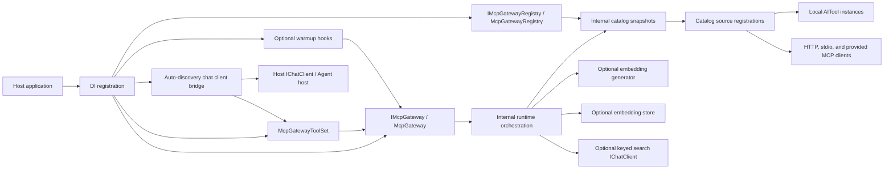
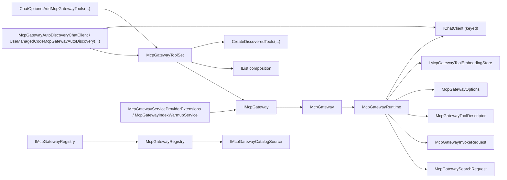
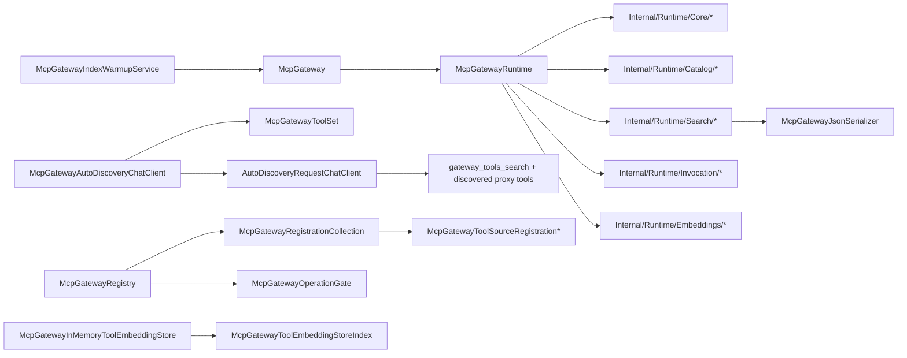

# Architecture Overview

## Scoping (read first)

This document is the module map for `ManagedCode.MCPGateway`.

In scope:

- package boundaries
- runtime collaboration between the public facade, registry, meta-tools, warmup hooks, and internal runtime
- dependency direction between public APIs, internal modules, and optional AI services

Out of scope:

- feature-level ranking metrics
- test corpus details
- CI or release process

## Summary

`ManagedCode.MCPGateway` exposes three public DI surfaces:

- `IMcpGateway` for list/search/invoke
- `IMcpGatewayRegistry` for catalog mutation
- `McpGatewayToolSet` for reusable meta-tools

`McpGateway` stays a thin facade over `McpGatewayRuntime`, which reads immutable catalog snapshots, coordinates vector or tokenizer-backed search, optionally rewrites queries through a keyed `IChatClient`, and invokes local or MCP tools. Optional startup warmup is available through a service-provider extension or hosted background service without changing the lazy default.

The package also keeps chat-client and agent integration generic: `McpGatewayToolSet` is the source of reusable `AITool` meta-tools and discovered proxy tools, `ChatOptions.AddMcpGatewayTools(...)` remains the low-level bridge, and `McpGatewayAutoDiscoveryChatClient` plus `UseManagedCodeMcpGatewayAutoDiscovery(...)` provide the recommended staged host wrapper that starts with two meta-tools and replaces the discovered proxy set on each new search result without introducing a hard Agent Framework dependency into the core package.

## System And Module Map

## Interfaces And Contracts

## Key Classes And Types

## Module Index

- Public facade: [`src/ManagedCode.MCPGateway/McpGateway.cs`](../../src/ManagedCode.MCPGateway/McpGateway.cs) exposes the package runtime API and delegates work to the internal runtime.
- Public abstractions: [`src/ManagedCode.MCPGateway/Abstractions/`](../../src/ManagedCode.MCPGateway/Abstractions/) defines the stable interfaces consumers resolve from DI.
- Public configuration: [`src/ManagedCode.MCPGateway/Configuration/`](../../src/ManagedCode.MCPGateway/Configuration/) contains options and service keys that shape host integration.
- Public models: [`src/ManagedCode.MCPGateway/Models/`](../../src/ManagedCode.MCPGateway/Models/) contains request/result contracts and enums grouped by search, invocation, catalog, and embeddings behavior.
- Public embeddings: [`src/ManagedCode.MCPGateway/Embeddings/`](../../src/ManagedCode.MCPGateway/Embeddings/) provides optional embedding-store implementations.
- Public meta-tools: [`src/ManagedCode.MCPGateway/McpGatewayToolSet.cs`](../../src/ManagedCode.MCPGateway/McpGatewayToolSet.cs) exposes the gateway as reusable `AITool` instances for model-driven search and invoke flows.
- Public chat-options bridge: [`src/ManagedCode.MCPGateway/Registration/McpGatewayChatOptionsExtensions.cs`](../../src/ManagedCode.MCPGateway/Registration/McpGatewayChatOptionsExtensions.cs) attaches the gateway meta-tools to `ChatOptions` without replacing existing tools.
- Public auto-discovery wrapper: [`src/ManagedCode.MCPGateway/McpGatewayAutoDiscoveryChatClient.cs`](../../src/ManagedCode.MCPGateway/McpGatewayAutoDiscoveryChatClient.cs) stages model-visible tools as `2 meta-tools -> latest discovered proxies -> replace on next search`.
- Public chat-client extensions: [`src/ManagedCode.MCPGateway/Registration/McpGatewayChatClientExtensions.cs`](../../src/ManagedCode.MCPGateway/Registration/McpGatewayChatClientExtensions.cs) wraps any `IChatClient` with the recommended staged auto-discovery flow.
- Internal catalog module: [`src/ManagedCode.MCPGateway/Internal/Catalog/`](../../src/ManagedCode.MCPGateway/Internal/Catalog/) owns mutable tool-source registration state and read-only snapshots for indexing.
- Internal catalog sources: [`src/ManagedCode.MCPGateway/Internal/Catalog/Sources/`](../../src/ManagedCode.MCPGateway/Internal/Catalog/Sources/) owns transport-specific source registrations and MCP client creation.
- Internal runtime module: [`src/ManagedCode.MCPGateway/Internal/Runtime/`](../../src/ManagedCode.MCPGateway/Internal/Runtime/) owns orchestration and is split by core, catalog, search, invocation, and embeddings concerns.
- Internal embedding helpers: [`src/ManagedCode.MCPGateway/Internal/Embeddings/`](../../src/ManagedCode.MCPGateway/Internal/Embeddings/) contains non-public embedding indexing helpers.
- Internal serialization: [`src/ManagedCode.MCPGateway/Internal/Serialization/`](../../src/ManagedCode.MCPGateway/Internal/Serialization/) contains the canonical JSON materialization path used by runtime features.
- Warmup hooks: [`src/ManagedCode.MCPGateway/Registration/McpGatewayServiceProviderExtensions.cs`](../../src/ManagedCode.MCPGateway/Registration/McpGatewayServiceProviderExtensions.cs) and [`src/ManagedCode.MCPGateway/Internal/Warmup/McpGatewayIndexWarmupService.cs`](../../src/ManagedCode.MCPGateway/Internal/Warmup/McpGatewayIndexWarmupService.cs) provide optional eager index-building integration.
- DI registration: [`src/ManagedCode.MCPGateway/Registration/McpGatewayServiceCollectionExtensions.cs`](../../src/ManagedCode.MCPGateway/Registration/McpGatewayServiceCollectionExtensions.cs) wires facade, registry, meta-tools, and warmup support into the container.

## Dependency Rules

- Public code may depend on `Models`, `Configuration`, and `Abstractions`, but internal modules must not depend on tests or docs.
- `McpGateway` is a thin facade only. It may delegate to `McpGatewayRuntime`, but it must not own registry mutation logic.
- `Internal/Catalog` owns mutable source registration state. `Internal/Runtime` may read snapshots from it, but must not mutate registrations directly.
- `Internal/Catalog/Sources` owns MCP transport-specific creation and caching. Transport setup must not leak into `Internal/Runtime`, `Models`, or `Configuration`.
- `Internal/Runtime` may depend on `Internal/Catalog`, `Internal/Embeddings`, `Embeddings`, `Models`, `Configuration`, and `Abstractions`.
- Optional AI services such as embedding generators and query-normalization chat clients must stay outside the package core and be resolved through DI service keys rather than hardwired provider code.
- Chat-client and agent integrations must stay `AITool`-centric in the core package. Host-specific frameworks may consume those tools, but the base package should not take a hard dependency on a specific agent host unless that becomes an explicit product decision.
- `McpGatewayAutoDiscoveryChatClient` may orchestrate tool visibility for host chat loops, but it must stay generic over `IChatClient` and must not take a dependency on Microsoft Agent Framework.
- The recommended staged host flow is: advertise only the two gateway meta-tools first, then project only the latest search matches as direct proxy tools, then replace that discovered set on the next search result.
- `Models` should stay contract-first. Internal transport, registry, or lifecycle helpers do not belong there.
- Embedding support must stay optional and isolated behind `IMcpGatewayToolEmbeddingStore` and embedding-generator abstractions.
- Warmup remains optional. The package must work correctly with lazy indexing and must not require manual initialization for every host.

## Key Decisions (ADRs)

- [`docs/ADR/ADR-0001-runtime-boundaries-and-index-lifecycle.md`](../ADR/ADR-0001-runtime-boundaries-and-index-lifecycle.md): documents the public/runtime/catalog split, DI boundaries, lazy indexing, cancellation-aware single-flight builds, and optional warmup hooks.
- [`docs/ADR/ADR-0002-search-ranking-and-query-normalization.md`](../ADR/ADR-0002-search-ranking-and-query-normalization.md): documents the default `Auto` search behavior, tokenizer-backed fallback, optional English query normalization, and mathematical ranking strategy.
- [`docs/ADR/ADR-0003-reusable-chat-client-and-agent-tool-modules.md`](../ADR/ADR-0003-reusable-chat-client-and-agent-tool-modules.md): documents why chat-client and agent integrations stay generic around reusable `AITool` modules instead of adding a hard Agent Framework dependency to the core package.

## Related Docs

- [`README.md`](../../README.md)
- [`docs/ADR/ADR-0001-runtime-boundaries-and-index-lifecycle.md`](../ADR/ADR-0001-runtime-boundaries-and-index-lifecycle.md)
- [`docs/ADR/ADR-0002-search-ranking-and-query-normalization.md`](../ADR/ADR-0002-search-ranking-and-query-normalization.md)
- [`docs/ADR/ADR-0003-reusable-chat-client-and-agent-tool-modules.md`](../ADR/ADR-0003-reusable-chat-client-and-agent-tool-modules.md)
- [`docs/Features/SearchQueryNormalizationAndRanking.md`](../Features/SearchQueryNormalizationAndRanking.md)
- [`AGENTS.md`](../../AGENTS.md)
