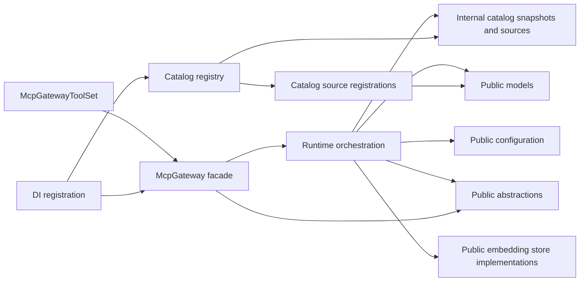
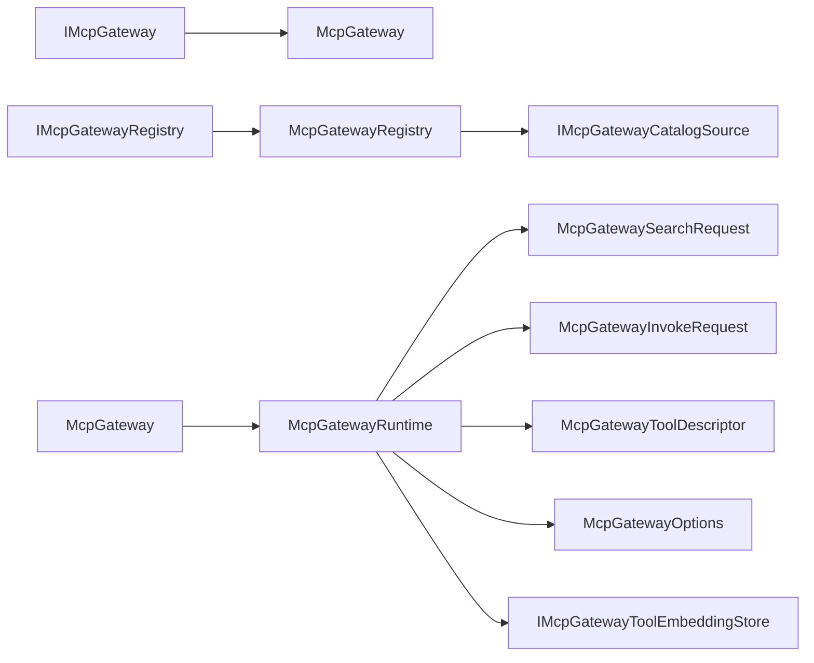
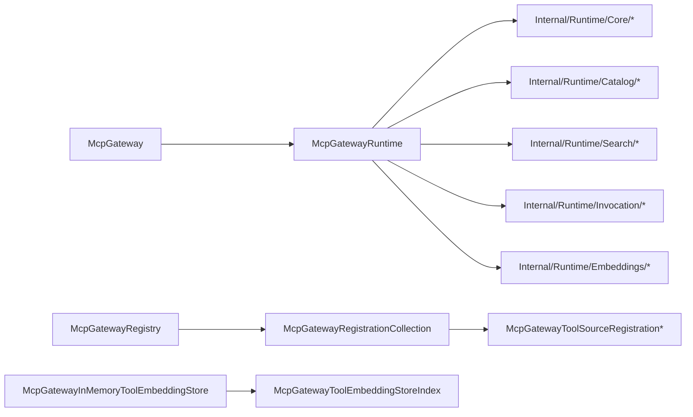

# Architecture Overview

## Scoping (read first)

This document is the module map for `ManagedCode.MCPGateway`.

In scope:

- package boundaries
- runtime collaboration between gateway facade, registry, runtime orchestration, and search/indexing helpers
- dependency direction between public APIs and internal modules

Out of scope:

- feature-level user flows
- tokenizer ranking details
- release or CI process

## Summary

`ManagedCode.MCPGateway` is a package-first library with one public execution surface, one separate catalog-mutation surface, and one internal runtime orchestrator. The key structural rule is that public contracts stay small and explicit, while internal catalog, runtime, and helper infrastructure live under `Internal/` with one-way dependencies toward public abstractions, configuration, and models.

## System And Module Map

## Interfaces And Contracts

## Key Classes And Types

## Module Index

- Public facade: [`src/ManagedCode.MCPGateway/McpGateway.cs`](../../src/ManagedCode.MCPGateway/McpGateway.cs) exposes the package runtime API and delegates work to the internal runtime.
- Public abstractions: [`src/ManagedCode.MCPGateway/Abstractions/`](../../src/ManagedCode.MCPGateway/Abstractions/) defines the stable interfaces consumers resolve from DI.
- Public configuration: [`src/ManagedCode.MCPGateway/Configuration/`](../../src/ManagedCode.MCPGateway/Configuration/) contains options and service keys that shape host integration.
- Public models: [`src/ManagedCode.MCPGateway/Models/`](../../src/ManagedCode.MCPGateway/Models/) contains request/result contracts and enums grouped by search, invocation, catalog, and embeddings behavior.
- Public embeddings: [`src/ManagedCode.MCPGateway/Embeddings/`](../../src/ManagedCode.MCPGateway/Embeddings/) provides optional embedding-store implementations.
- Internal catalog module: [`src/ManagedCode.MCPGateway/Internal/Catalog/`](../../src/ManagedCode.MCPGateway/Internal/Catalog/) owns mutable tool-source registration state and read-only snapshots for indexing.
- Internal catalog sources: [`src/ManagedCode.MCPGateway/Internal/Catalog/Sources/`](../../src/ManagedCode.MCPGateway/Internal/Catalog/Sources/) owns transport-specific source registrations and MCP client creation.
- Internal runtime module: [`src/ManagedCode.MCPGateway/Internal/Runtime/`](../../src/ManagedCode.MCPGateway/Internal/Runtime/) owns orchestration and is split by core, catalog, search, invocation, and embeddings concerns.
- Internal embedding helpers: [`src/ManagedCode.MCPGateway/Internal/Embeddings/`](../../src/ManagedCode.MCPGateway/Internal/Embeddings/) contains non-public embedding indexing helpers.
- DI registration: [`src/ManagedCode.MCPGateway/Registration/McpGatewayServiceCollectionExtensions.cs`](../../src/ManagedCode.MCPGateway/Registration/McpGatewayServiceCollectionExtensions.cs) wires facade, registry, tool set, and internal catalog source into the container.

## Dependency Rules

- Public code may depend on `Models`, `Configuration`, and `Abstractions`, but internal modules must not depend on tests or docs.
- `McpGateway` is a thin facade only. It may delegate to `McpGatewayRuntime`, but it must not own registry mutation logic.
- `Internal/Catalog` owns mutable source registration state. `Internal/Runtime` may read snapshots from it, but must not mutate registrations directly.
- `Internal/Catalog/Sources` owns MCP transport-specific creation and caching. Transport setup must not leak into `Internal/Runtime`, `Models`, or `Configuration`.
- `Internal/Runtime` may depend on `Internal/Catalog`, `Internal/Embeddings`, `Embeddings`, `Models`, `Configuration`, and `Abstractions`.
- `Models` should stay contract-first. Internal transport, registry, or lifecycle helpers do not belong there.
- Embedding support must stay optional and isolated behind `IMcpGatewayToolEmbeddingStore` and embedding-generator abstractions.

## Key Decisions (ADRs)

- No ADR files exist yet for this package. When boundaries or dependency rules become more complex, add an ADR under `docs/ADR/` and link it here.

## Related Docs

- [`README.md`](../../README.md)
- [`docs/Features/SearchQueryNormalizationAndRanking.md`](../Features/SearchQueryNormalizationAndRanking.md)
- [`AGENTS.md`](../../AGENTS.md)
