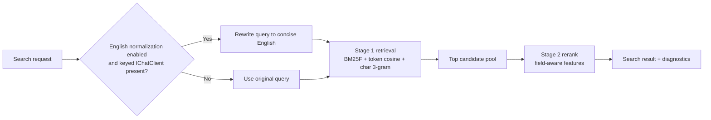

# Search Query Normalization And Ranking

## Purpose And Scope

This feature improves `ManagedCode.MCPGateway` search quality for multilingual, typo-heavy, and weakly specified search requests without introducing phrase-level hardcoded rules.

In scope:

- optional English query normalization before ranking
- tokenizer-backed ranking improvements for non-embedding search
- deterministic fallback when no AI normalizer is registered
- automated verification for multilingual, noisy, and borderline search buckets

Out of scope:

- embedding model changes
- vendor-specific AI SDK setup inside the package
- domain-specific synonym lists or handcrafted query exceptions

## Affected Modules

- `src/ManagedCode.MCPGateway/Configuration/McpGatewayOptions.cs`
- `src/ManagedCode.MCPGateway/Configuration/McpGatewayServiceKeys.cs`
- `src/ManagedCode.MCPGateway/Models/Search/*`
- `src/ManagedCode.MCPGateway/Internal/Runtime/Search/*`
- `tests/ManagedCode.MCPGateway.Tests/Search/*`
- `README.md`

## Business Rules

1. Tokenizer-backed search must stay functional with zero embedding or chat-model dependencies.
2. When query normalization is enabled and a keyed `IChatClient` is available, the gateway must normalize the user query into concise English before ranking.
3. Query normalization must preserve identifiers and retrieval-critical literals such as emails, repository names, CVE references, order numbers, tracking numbers, and SKUs.
4. If normalization is enabled but no keyed normalizer client is registered, the gateway must continue with the original query and must not fail the search.
5. If normalization fails, the gateway must continue with the original query and expose a diagnostic rather than throwing.
6. Tokenizer-backed ranking must prefer mathematical retrieval improvements over text-level hardcoded exceptions.
7. Tokenizer-backed ranking must improve recall for typos and multilingual cognates while also reducing domain-local ties such as `invoice` versus `payment reconciliation`.
8. The package must keep one built-in tokenizer-backed search path and must not expose stale tokenizer-selection options.
9. Default search result limits and existing public search/invoke entry points must remain intact.

## Main Flow

## Negative And Edge Cases

- Empty query with no context still returns `browse` mode.
- Empty catalog still returns `empty` mode.
- A registered embedding generator still takes precedence when vector search is active.
- A normalization client that returns blank output must not replace the original query.
- A normalization client that times out or throws must emit a diagnostic and fall back to the original query.
- Typo-heavy inputs such as `shipmnt` and `contcat` must still retrieve the expected tool in the result set.
- Multilingual inputs without a normalizer must still benefit from tokenizer aliases and character n-grams.

## System Behavior

- Entry points:
  - `IMcpGateway.SearchAsync(string?, int?, CancellationToken)`
  - `IMcpGateway.SearchAsync(McpGatewaySearchRequest, CancellationToken)`
- Reads:
  - tool catalog snapshot from `IMcpGatewayCatalogSource`
  - keyed optional search normalizer client from DI
  - search options from `McpGatewayOptions`
- Writes:
  - no persistent writes beyond existing optional embedding-store behavior
- Side effects:
  - optional `IChatClient` request for query normalization
  - diagnostics describing normalization fallback or low-confidence conditions
- Idempotency:
  - same indexed catalog and same deterministic query-normalizer response yield stable ranking
- Errors:
  - search must not throw only because the optional normalizer is missing or fails

## Verification

Environment assumptions:

- .NET 10 SDK from `global.json`
- `TUnit` on `Microsoft.Testing.Platform`

Verification commands:

- `dotnet restore ManagedCode.MCPGateway.slnx`
- `dotnet build ManagedCode.MCPGateway.slnx -c Release --no-restore`
- `dotnet build ManagedCode.MCPGateway.slnx -c Release --no-restore -p:RunAnalyzers=true`
- `dotnet test --solution ManagedCode.MCPGateway.slnx -c Release --no-build`

Test mapping:

- normalization success and fallback behavior in `tests/ManagedCode.MCPGateway.Tests/Search/`
- tokenizer ranking regression coverage in `McpGatewayTokenizerSearchTests.cs`
- evaluation-bucket quality coverage in `McpGatewayTokenizerSearchEvaluationTests.cs`

## Definition Of Done

- tokenizer-backed search supports optional English query normalization through `Microsoft.Extensions.AI`
- multilingual and typo-heavy evaluation scenarios remain covered by automated tests
- docs explain how to register the optional query-normalization client
- build, analyzers, and tests stay green

## Related Docs

- [`README.md`](../../README.md)
- [`docs/ADR/ADR-0002-search-ranking-and-query-normalization.md`](../ADR/ADR-0002-search-ranking-and-query-normalization.md)
- [`docs/ADR/ADR-0001-runtime-boundaries-and-index-lifecycle.md`](../ADR/ADR-0001-runtime-boundaries-and-index-lifecycle.md)
- [`docs/Architecture/Overview.md`](../Architecture/Overview.md)

## Implementation Plan (step-by-step)

1. Add search-normalization configuration to `McpGatewayOptions` and a keyed DI service key for the optional normalizer chat client.
2. Implement normalization in the search pipeline with graceful fallback and diagnostics.
3. Replace the flat tokenizer score with a two-stage ranking flow that uses field-aware BM25-style retrieval plus character n-gram retrieval.
4. Add deterministic tests for query normalization, failure fallback, and updated ranking behavior.
5. Update `README.md` with configuration and operational guidance.
